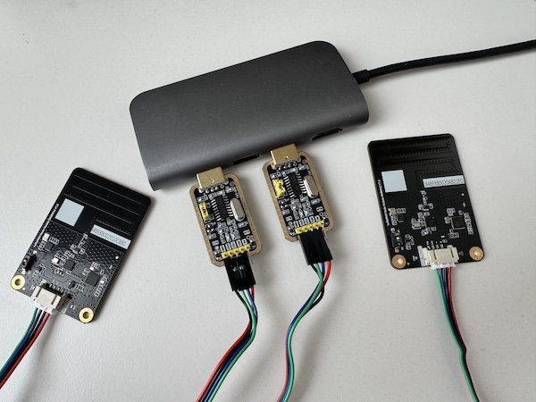

# Gravity: LoRaWAN Node Module 

[](https://python.org)
[](https://micropython.org)

You can find the details about LoRaWAN Node Modules on the DFRobot [Wiki](https://wiki.dfrobot.com/SKU_DFR1115-868_Gravity_LoRaWAN_Node_Module_EU868) page. The original CPP drivers and Arduino examples are available on DFRobots [GitHub](https://github.com/cdjq/DFRobot_LWNode) repository.

## Python (_serial_)

The Python serial module supports LoRa and LoRaWAN modes for EU868/US915/CN470.

### Quick Installation

```shell
# clone project
$ git clone https://github.com/Lupin3000/DFRobot_LoRaWAN_NodeModules.git

# change into cloned project directory
$ cd DFRobot_LoRaWAN_NodeModules/

# create python virtualenv (optional)
$ python3 -m venv .venv

# activate Python virtualenv (macOS & Linux)
$ source .venv/bin/activate

# update pip (optional)
(.venv) $ pip3 install -U pip

# install required dependencies
(.venv) $ pip3 install -r serial_requirements.txt

# show packages (optional)
(.venv) $ pip3 freeze
```

### Run LoRa (P2P) serial example

Set the dial switch to UART and connect the node modules.



_The picture shows the usage of two CH340 USB to TTL converters for each Node module._

Before running the examples to send and receive data. Ensure the configuration settings meet your requirements! Therefor, adapt files `conf/lora_configuration.py` and `conf/serial_configuration.py`.

```shell
# start serial receive
(.venv) $ python3 example_serial_receive.py

Received payload: Hello (0)
Received payload: Hello (1)
Received payload: Hello (2)
Received payload: Hello (3)
Received payload: Hello (4)
[INFO] Closing serial connection.
[INFO] Exiting...
[INFO] Closing application...

# start serial send
(.venv) $ python3 example_serial_send.py

Received payload: Hello (0)
Received payload: Hello (1)
Received payload: Hello (2)
Received payload: Hello (3)
Received payload: Hello (4)
[INFO] Closing application...
```

## MicroPython (_UART_)

The MicroPython UART module supports LoRa and LoRaWAN modes for EU868/US915/CN470.

### Quick Installation

```shell
# clone project
$ git clone https://github.com/Lupin3000/DFRobot_LoRaWAN_NodeModules.git

# change into cloned project directory
$ cd DFRobot_LoRaWAN_NodeModules/

# create python virtualenv (optional)
$ python3 -m venv .venv

# activate Python virtualenv (macOS & Linux)
$ source .venv/bin/activate

# update pip (optional)
(.venv) $ pip3 install -U pip

# install required dependencies
(.venv) $ pip3 install -r uart_requirements.txt

# show packages (optional)
(.venv) $ pip3 freeze
```

If MicroPython is not flashed on the ESP device, download the latest firmware from [MicroPython](https://micropython.org/download/). The next step is to flash the MicroPython firmware on the ESP device via the esptool. After that, use rshell to connect to the ESP device and upload the required directories and files.

> **Note:** In case you are not familiar with command line tools like esptool, try [MicroPython-Firmware-Studio](https://github.com/Lupin3000/MicroPython-Firmware-Studio).

### Run LoRa (P2P) UART example

```
# send messages
Sending message: Hello (0)
Sending message: Hello (1)
Sending message: Hello (2)
Sending message: Hello (3)
Sending message: Hello (4)

# receive messages
Received payload: Hello (0)
Received payload: Hello (1)
Received payload: Hello (2)
Received payload: Hello (3)
Received payload: Hello (4)
```
